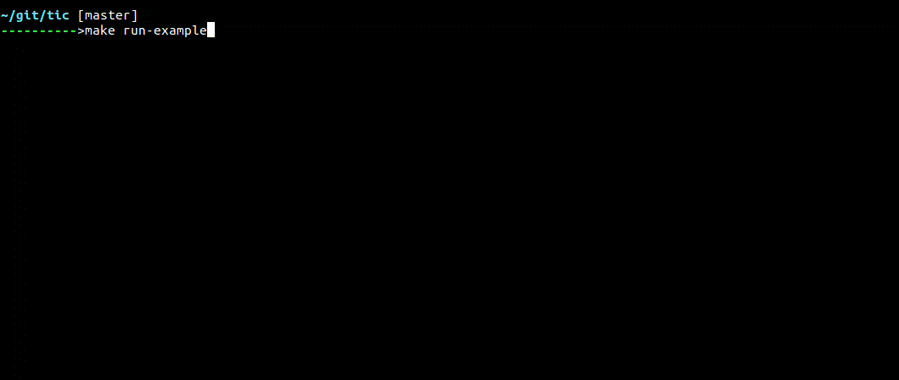

# tic
Command line http client.



## Features
* Reading openapi files from predefined locations
* Profiles for different setups and environments
* Environments for different security settings and variables
* Persisting of entered parameters, request bodies, and tokens

## Try it out
The example folder contains a full working configuration with a dummy openapi, public pem key, and data files.
To try it out, run one of
```
make run-example
make run-example-debug
```
which will build tic and run it from the example directory (debug version prints verbose information).

## Install
```
make install
```
Will install tic into your cargo bin directory, usually `/home/username/.cargo/bin/`.

## Usage
To use tic, you need a configuration in your current directory or home folder named `.tic-config.json`.
`.tic-config.example.json` contains an example of what the file can contain.

#### api
A list of services specified by a domain and the path to an openapi version 3 file in json format.
All requests to the service will be made to the domain with current profile protocol prepended and tld appended.

#### profile
Each containing a setup consisting of an env, an auth, and an optional data configuration.

#### env
Each containing a protocol and top level domain.

#### auth
Each containing a path to a public key for jwt validation and an optional path for persisiting the token between runs.

#### data
Each containing a path referring to a json file which will persist data entered such as parameters and request bodies.
